<h1 align="center">
  NovaDirector AI<br/>
  <sup>BeatSheet-AI</sup>
</h1>

<p align="center">
  <b>从小说到剧本，从故事到银幕。</b><br/>
  <sub>AI-NUSS 3.0 -- 小说至剧本智能改编引擎</sub>
</p>

<p align="center">
  
  
  
  
  
</p>

---

<p align="center">
  
</p>

---

## 项目概述

**NovaDirector AI** 是一款全栈 AI 应用，能够将小说自动改编为专业剧本。系统基于 LangGraph 多智能体流水线架构，支持任意兼容 OpenAI 接口的大语言模型（DeepSeek、OpenAI、OpenRouter 等），通过七个专项 AI 智能体协同工作，将原始小说文本依次完成叙事分析、角色消歧、场景切分、节拍提取以及导演级影视化指导，最终输出结构化剧本。

系统产出达到专业制作标准：包含编号场景、戏剧节拍、角色行为约束、镜头规划、灯光指导和情绪基调，全部可在实时导演控制台中查看。

<table>
<tr>
<td width="50%">

### 核心能力
- **上传小说**（.txt / .docx / .pdf）即可获得完整剧本
- **七阶段 AI 流水线**，WebSocket 实时推送进度
- **角色消歧**，支持别名合并与置信度评分
- **场景切分**，五种规则类型外加 AI 语义增强
- **导演副驾驶**，逐场景生成镜头、灯光、配乐方案
- **实时数据看板**，展示质量指标与健康度评分

</td>
<td width="50%">

### 架构概览

```
小说 -> [文档解析] -> [叙事分析] -> [故事圣经]
  -> [角色消歧] -> [场景切分]
  -> [剧本生成] -> [导演分析]
  -> 结构化剧本输出
```

- **LangGraph 有向无环图** 编排七个智能体节点
- **WebSocket** 实时推送事件至 React 前端
- **兼容 OpenAI 接口** -- 用户自行选择模型供应商
- **双模运行**：AI 调用与确定性规则回退并行

</td>
</tr>
</table>

---

## 核心功能

<table>
<tr>
<td width="33%">

### 多智能体 AI 流水线
六个专项 AI 智能体在有向无环图中协作，每个负责改编流程的一个阶段。智能体之间通过共享的 LangGraph 状态对象通信，具备完整的版本控制与审计追踪能力。

**智能体列表：**
- `NarrativeAnalyzer` -- 主题、类型、前提、冲突提取
- `BibleAgent` -- 世界观设定、组织架构、全局规则
- `CharacterAgent` -- 实体识别、别名消歧、行为约束构建
- `SceneAgent` -- 五类分场引擎 + AI 元数据增强
- `ScreenplayAgent` -- 节拍提取、对白与动作生成
- `DirectorAgent` -- 镜头规划、灯光、配乐、节奏指导

</td>
<td width="33%">

### 场景切分引擎
确定性五类场景边界检测器，覆盖以下分场类型：
- **场景转换** -- 物理地点发生变化
- **时间推移** -- 同一地点时间跨越
- **闪回插叙** -- 记忆与意识流回溯
- **蒙太奇段落** -- 时空压缩与意象组接
- **平行叙事** -- 多线同步事件

内置质量评分体系（结构 25% + 角色互动 20% + 冲突 20% + 动作 15% + 对白 20%），按 A-D 等级评定。

</td>
<td width="33%">

### 导演副驾驶
生成完成后进行二次影视化分析，逐场景输出：
- **情绪基调** -- 悬疑 / 浪漫 / 动作 / 神秘等
- **视觉风格** -- 犯罪剧 / 科幻 / 历史 / 奇幻等
- **镜头方案** -- 3 至 5 个镜头（全景、特写、跟拍等）
- **灯光指导** -- 逐场景描述性灯光方案
- **配乐方向** -- 带有情感意图的配乐建议
- **叙事节奏** -- 慢 / 中 / 快

</td>
</tr>
</table>

---

## 流水线工作流

```mermaid
graph TD
    A[文档解析] -->|章节| B[叙事分析]
    B -->|主题、类型、冲突| C[故事圣经]
    C -->|世界观、规则| D[角色消歧]
    D -->|置信度通过| E[场景切分]
    D -->|置信度不足| R[人工审核]
    R -->|审核完成| E
    E -->|场景列表| F[节拍与剧本生成]
    F -->|节拍、对白| G[导演分析]
    G -->|镜头、灯光、配乐| H[完成]

    style A fill:#1a1a2e,stroke:#16213e
    style H fill:#0f3460,stroke:#16213e
    style R fill:#e94560,stroke:#e94560
```



| 阶段 | 负责智能体 | 进度 | 产出物 |
|-------|-------|----------|--------|
| **0. 解析** | 内核（规则引擎） | 0-10% | 章节划分、字数统计 |
| **1. 叙事分析** | `NarrativeAnalyzer` | 10-20% | 主题、类型、前提、冲突 |
| **2. 故事圣经** | `BibleAgent` | 20-28% | 世界观设定、组织、规则 |
| **3. 角色消歧** | `CharacterAgent` | 28-40% | 实体映射、角色列表、行为约束 |
| **4. 场景切分** | `SceneAgent` | 40-65% | 编号场景及元数据 |
| **5. 剧本生成** | `ScreenplayAgent` | 65-95% | 节拍、对白、动作描述 |
| **5.5. 导演分析** | `DirectorAgent` | 93-98% | 逐场景影视化指导 |
| **6. 完成** | -- | 98-100% | 最终结构化剧本 |

---

## 界面截图

<p align="center">
  <b>导演控制台 -- 工作区</b><br/>
  
</p>

<details>
<summary><b>更多截图（点击展开）</b></summary>

<p align="center">
  <b>场景工作台与质量看板</b><br/>
  
</p>

<p align="center">
  <b>角色关系图谱</b><br/>
  
</p>

<p align="center">
  <b>剧本查看器</b><br/>
  
</p>

<p align="center">
  <b>模型配置面板</b><br/>
  
</p>

<p align="center">
  <b>上传与处理流水线</b><br/>
  
</p>

</details>

---

## 快速开始

### 环境要求

- **Python** 3.11 及以上版本
- **Node.js** 18 及以上版本（含 npm）
- **Docker**（可选 -- 用于运行 PostgreSQL、Redis、Qdrant）
- 任意兼容 OpenAI 接口的 API 密钥

### 一键启动

```bash
# 克隆仓库
git clone https://github.com/66530/BeatSheet-AI.git
cd BeatSheet-AI/ai_nuss_workspace

# 一键启动（自动安装依赖并启动前后端）
python run.py
```

启动后访问 **http://localhost:3000**，导演控制台将自动打开。

### 手动启动

```bash
# 终端 1 -- 后端
cd ai_nuss_backend
pip install -r requirements.txt
uvicorn app.main:app --host 0.0.0.0 --port 8000

# 终端 2 -- 前端
cd ai_nuss_frontend
npm install --legacy-peer-deps
npm run dev
```

### Docker 全栈部署

```bash
# 启动全部服务（PostgreSQL、Redis、Qdrant、后端、前端、Nginx）
cd ai_nuss_workspace/deployment
docker compose up -d
```

---

## 模型配置

### 接入大语言模型

NovaDirector AI 兼容**任意 OpenAI 接口格式的 API**。模型配置在浏览器界面中完成，数据存储在本地浏览器，不会发送至任何外部服务器。

<p align="center">
  
</p>

**内置支持的供应商：**

| 供应商 | Base URL | 推荐模型 |
|----------|----------|-------------------|
| **DeepSeek** | `https://api.deepseek.com` | `deepseek-chat` |
| **OpenAI** | `https://api.openai.com/v1` | `gpt-4o-mini` |
| **OpenRouter** | `https://openrouter.ai/api/v1` | `openai/gpt-4o` |
| **SiliconFlow** | `https://api.siliconflow.cn/v1` | `Qwen/Qwen2.5-7B-Instruct` |
| **Moonshot** | `https://api.moonshot.cn/v1` | `moonshot-v1-8k` |
| **智谱** | `https://open.bigmodel.cn/api/paas/v4` | `glm-4-flash` |
| **阿里百炼** | `https://dashscope.aliyuncs.com/compatible-mode/v1` | `qwen-max` |
| **自定义** | *用户自定义地址* | *用户自定义模型* |

### 环境变量

```bash
# .env 文件 -- 后端配置
STUB_MODE=false           # 设为 true 启用离线/演示模式，不调用 API
DEBUG=true                # 启用调试模式
DATABASE_URL=...          # PostgreSQL 连接字符串（Docker 部署时已预设）
REDIS_HOST=localhost      # Redis 主机地址
QDRANT_URL=...            # Qdrant 向量数据库地址
```

---

## API 参考

| 方法 | 端点 | 说明 |
|--------|----------|-------------|
| `GET` | `/health` | 健康检查（无需认证，不依赖数据库） |
| `GET` | `/docs` | Swagger 交互式文档 |
| `POST` | `/api/v1/auth/login` | 用户登录 |
| `POST` | `/api/v1/jobs/submit` | 提交小说开始改编 |
| `GET` | `/api/v1/jobs/{job_id}/status` | 查询任务状态与完整数据 |
| `GET` | `/api/v1/jobs/` | 列出全部历史任务 |
| `POST` | `/api/v1/jobs/{job_id}/review/bible-character` | 审核角色消歧结果 |
| `POST` | `/api/v1/jobs/{job_id}/review/scenes` | 审核场景边界划分 |
| `POST` | `/api/v1/model/test` | 测试模型连接状态 |
| `WS` | `/api/v1/ws/jobs/{job_id}/stream` | 实时任务进度推送 |

### WebSocket 事件类型

```
state_snapshot    -> 连接建立时的完整状态快照
progress_update   -> 阶段与百分比变更通知
scene_refining    -> 正在增强的场景信息
scene_refined     -> 场景增强完成通知
character_found   -> 新识别到的角色信息
beat_generated    -> 从场景中提取到的节拍
director_complete -> 导演分析阶段完成
pipeline_complete -> 全部流程执行完毕
pipeline_error    -> 错误信息及堆栈追踪
```

---

## 项目结构

```
BeatSheet-AI/
├── README.md
└── ai_nuss_workspace/
    ├── run.py                          # 一键启动脚本
    ├── run.sh                          # Linux/macOS 启动脚本
    ├── run.bat                         # Windows 启动脚本
    │
    ├── ai_nuss_backend/                # FastAPI + LangGraph 后端
    │   ├── app/
    │   │   ├── main.py                 # 入口文件、生命周期、CORS
    │   │   ├── api/v1/
    │   │   │   ├── router.py           # API 路由聚合
    │   │   │   └── endpoints/
    │   │   │       ├── auth.py         # 认证接口
    │   │   │       ├── jobs.py         # 任务 CRUD 与模型测试
    │   │   │       └── websocket.py    # 实时数据推送
    │   │   ├── core/
    │   │   │   ├── config.py           # 全局配置与权重矩阵
    │   │   │   ├── kernel.py           # 规则引擎处理逻辑
    │   │   │   ├── job_store.py        # 内存状态存储
    │   │   │   ├── processor.py        # 流水线编排器
    │   │   │   └── llm_factory.py      # OpenAI 兼容客户端工厂
    │   │   ├── graph/
    │   │   │   ├── state.py            # AINUSSState 类型定义
    │   │   │   ├── workflow.py         # LangGraph 有向无环图定义
    │   │   │   └── agents/
    │   │   │       ├── base.py         # 基类智能体，含回退机制
    │   │   │       ├── narrative_analyzer.py
    │   │   │       ├── bible_agent.py
    │   │   │       ├── character_agent.py
    │   │   │       ├── scene_agent.py
    │   │   │       ├── screenplay_agent.py
    │   │   │       └── director_agent.py
    │   │   └── schemas/
    │   │       ├── screenplay_yaml.py  # 剧本输出结构定义
    │   │       └── workflow.py         # WebSocket 帧结构定义
    │   ├── evaluation/
    │   │   └── gold_standard/          # 基准评测数据集
    │   └── requirements.txt
    │
    ├── ai_nuss_frontend/               # Next.js 14 前端
    │   ├── app/
    │   │   ├── layout.tsx              # 根布局与元数据
    │   │   ├── page.tsx                # 首页（重定向至工作区）
    │   │   ├── api_client.ts           # HTTP 与 WebSocket 客户端
    │   │   ├── globals.css             # 设计系统与主题样式
    │   │   ├── contexts/
    │   │   │   └── AuthContext.tsx      # 认证状态管理
    │   │   ├── components/
    │   │   │   └── HeaderNav.tsx        # 顶部导航栏
    │   │   └── workspace/
    │   │       ├── page.tsx             # 主工作区页面（多标签页）
    │   │       ├── scene_editor.tsx      # 场景编辑器
    │   │       ├── scene_distribution.tsx
    │   │       ├── character_graph.tsx   # 角色关系图谱
    │   │       ├── screenplay_viewer.tsx # 剧本查看器
    │   │       ├── ModelConfigPanel.tsx  # 大语言模型配置面板
    │   │       └── PrintScreenplay.tsx   # 剧本导出
    │   ├── package.json
    │   └── next.config.js
    │
    └── deployment/
        ├── docker-compose.yml           # 全栈编排配置
        └── docker/
            ├── backend.Dockerfile
            ├── frontend.Dockerfile
            └── nginx.conf
```

---

## 设计理念

### 优雅降级
每个 AI 智能体均采用**双路径架构**：`_run_real()` 调用用户配置的大语言模型，`_run_mock()` 提供基于确定性规则的回退方案。即使 API 调用失败，系统仍以合理默认值继续运行 -- 流水线不会因单点故障而崩溃。

### 状态版本化
所有状态变更均带版本号（`story_bible_version`、`entity_map_version`、`scene_version`、`director_version`），并原子化记录至 `event_log` 审计追踪日志。

### 用户自主选择模型
不绑定任何特定模型供应商。系统接受任意兼容 OpenAI 接口的 API 端点。模型配置按任务独立设置，存储在客户端浏览器中，使用前先行测试连通性。

### 实时优先
WebSocket 实时推送配合指数退避重连机制，确保导演控制台始终展示最新进度。断线重连时自动执行状态对账，防止数据丢失。

---

## 评测基准

项目内置金标准评测数据集，用于评估改编质量：

```
evaluation/gold_standard/
├── novel_001/
│   ├── entities.json    # 标准角色标注
│   ├── scenes.json      # 预期场景边界
│   └── beats.json       # 预期戏剧节拍
└── novel_002/
    ├── entities.json
    ├── scenes.json
    └── beats.json
```

---

## 技术栈

<table>
<tr>
<th>层级</th>
<th>技术</th>
<th>用途</th>
</tr>
<tr>
<td>前端</td>
<td>Next.js 14, React 18, TypeScript, Tailwind CSS</td>
<td>导演控制台界面</td>
</tr>
<tr>
<td>后端</td>
<td>FastAPI, Uvicorn, Python 3.11+</td>
<td>异步 REST 与 WebSocket API</td>
</tr>
<tr>
<td>AI 编排</td>
<td>LangGraph, LangGraph Checkpoint</td>
<td>多智能体有向无环图工作流</td>
</tr>
<tr>
<td>大语言模型</td>
<td>OpenAI SDK（兼容模式），任意供应商</td>
<td>各智能体的语言模型调用</td>
</tr>
<tr>
<td>数据库</td>
<td>PostgreSQL 15, Redis 7</td>
<td>状态持久化与发布订阅</td>
</tr>
<tr>
<td>向量数据库</td>
<td>Qdrant v1.8</td>
<td>角色语义检索</td>
</tr>
<tr>
<td>容器化</td>
<td>Docker, Docker Compose, Nginx</td>
<td>生产环境部署</td>
</tr>
<tr>
<td>实时通信</td>
<td>WebSocket（原生）+ 指数退避重连</td>
<td>实时进度推送</td>
</tr>
<tr>
<td>认证</td>
<td>PyJWT, 浏览器 localStorage</td>
<td>基于令牌的身份认证</td>
</tr>
</table>
