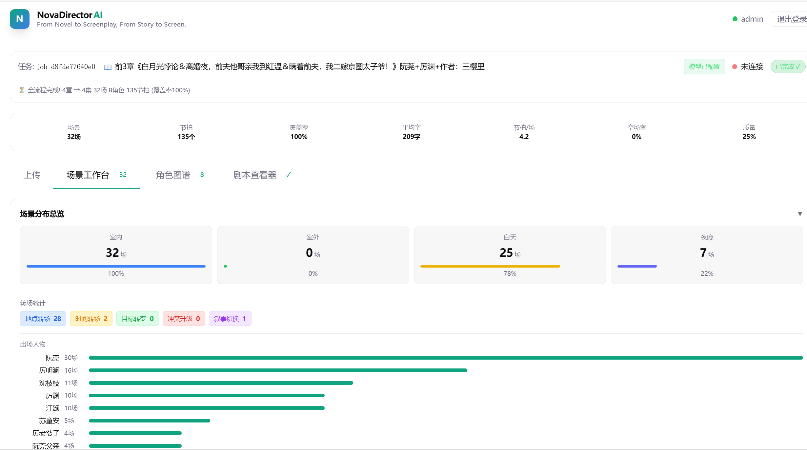
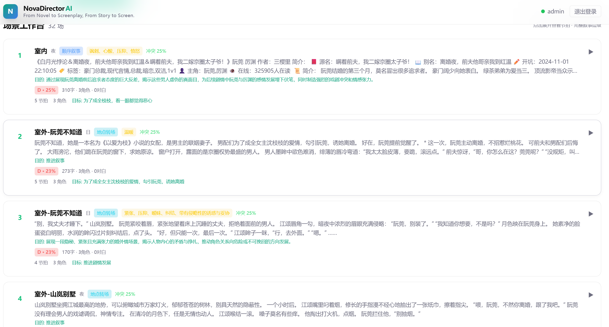
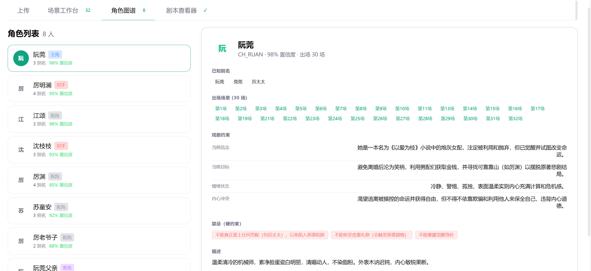
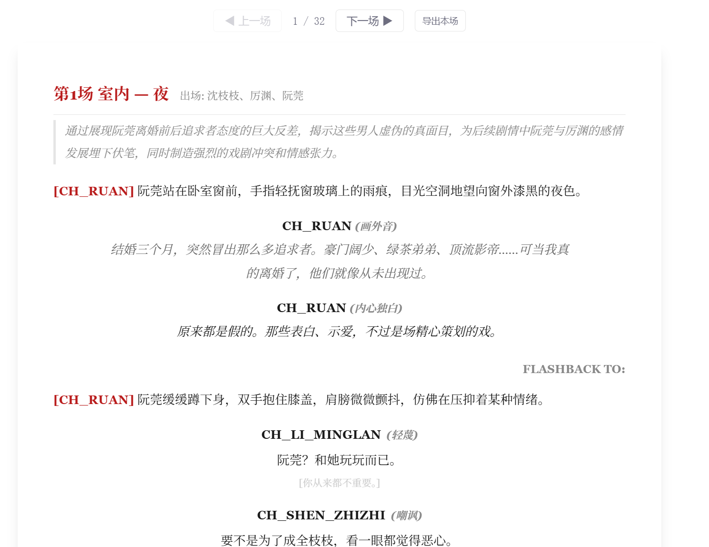
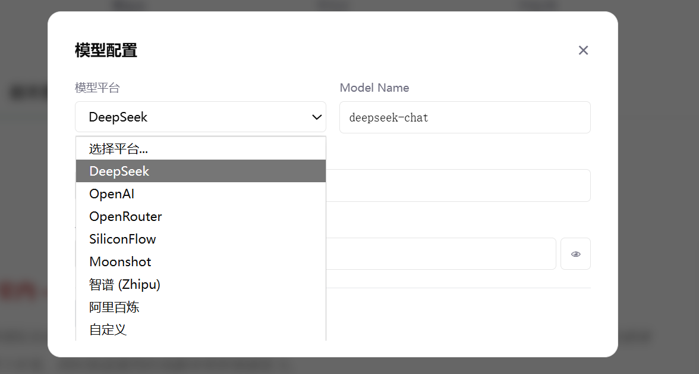
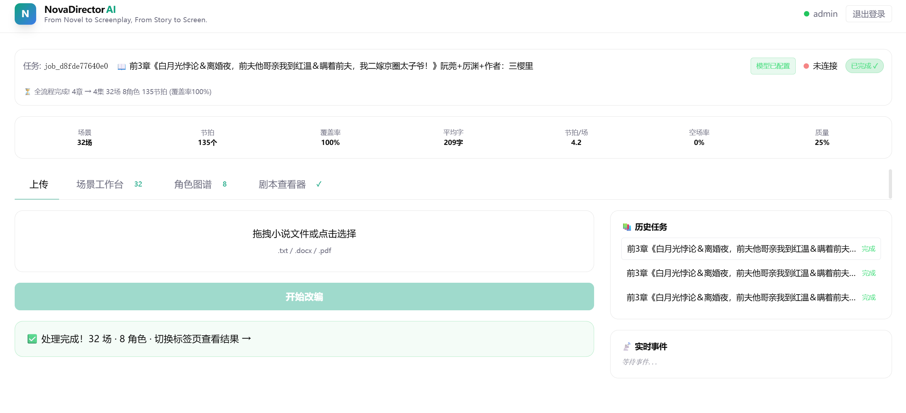

<h1 align="center">
  NovaDirector AI<br/>
  <sup>BeatSheet-AI</sup>
</h1>

<p align="center">
  <b>From Novel to Screenplay, From Story to Screen.</b><br/>
  <sub>AI-NUSS 3.0 — Novel to Screenplay Adaptation Engine</sub>
</p>

<p align="center">
  
  
  
  
  
</p>

---

<p align="center">
  
</p>

---

## Overview

**NovaDirector AI** is a full-stack AI application that automatically adapts novels into professional screenplays. Powered by a multi-agent LangGraph pipeline and any OpenAI-compatible LLM (DeepSeek, OpenAI, OpenRouter, etc.), it transforms raw novel text through seven specialized AI agents — from narrative analysis and character disambiguation to scene segmentation, beat extraction, and director-level cinematic guidance.

The system produces studio-ready output: numbered scenes with dramatic beats, character constraints, camera plans, lighting directions, and emotional tone — all viewable in a real-time director console.

<table>
<tr>
<td width="50%">

### What It Does
- **Upload a novel** (.txt / .docx / .pdf) and receive a complete screenplay
- **7-stage AI pipeline** with real-time WebSocket progress tracking
- **Character disambiguation** with confidence scoring and alias resolution
- **Scene segmentation** by 5 rule types plus AI enrichment
- **Director copilot** — camera plans, lighting, music per scene
- **Real-time dashboard** with quality metrics and health scores

</td>
<td width="50%">

### Architecture at a Glance

```
Novel -> [Parser] -> [Narrative Analyzer] -> [Story Bible]
  -> [Character Resolver] -> [Scene Segmenter]
  -> [Screenplay Generator] -> [Director Agent]
  -> Structured Screenplay
```

- **LangGraph DAG** orchestrates 7 agent nodes
- **WebSocket** streams live events to the React frontend
- **OpenAI-compatible** — BYO model (DeepSeek, GPT, etc.)
- **Dual-mode**: AI-powered + deterministic fallback

</td>
</tr>
</table>

---

## Key Features

<table>
<tr>
<td width="33%">

### Multi-Agent AI Pipeline
6 specialized AI agents collaborate in a directed acyclic graph, each handling one stage of adaptation. Agents communicate via a shared LangGraph state object with full versioning and audit trails.

**Agents:**
- `NarrativeAnalyzer` — Theme, genre, premise, conflict extraction
- `BibleAgent` — World setting, organizations, global rules
- `CharacterAgent` — Entity resolution, alias disambiguation, constraint building
- `SceneAgent` — 5-type segmentation engine + AI enrichment
- `ScreenplayAgent` — Beat extraction, dialogue/action generation
- `DirectorAgent` — Camera plans, lighting, music, pacing per scene

</td>
<td width="33%">

### Scene Segmentation Engine
A deterministic 5-type scene boundary detector handles:
- **Location Shift** — Physical scene changes
- **Time Shift** — Same location, different time
- **Flashback** — Memory/consciousness transitions
- **Montage** — Spatial/temporal compression
- **Simultaneous** — Parallel timeline events

Plus a quality scoring system (25% structure + 20% character + 20% conflict + 15% action + 20% dialogue) with A-D grading.

</td>
<td width="33%">

### Director Copilot
Post-generation cinematic analysis produces per-scene:
- **Emotion** — suspense / romantic / action / mysterious / ...
- **Visual Style** — crime_drama / sci_fi / historical / ...
- **Camera Plan** — 3-5 shots (establishing, close_up, tracking, ...)
- **Lighting** — descriptive lighting direction per scene
- **Music** — score direction with emotional intent
- **Pacing** — slow / medium / fast

</td>
</tr>
</table>

---

## Pipeline Workflow

```mermaid
graph TD
    A[Document Parser] -->|chapters| B[Narrative Analyzer]
    B -->|theme, genre, conflict| C[Story Bible]
    C -->|world, rules| D[Character Resolver]
    D -->|confidence OK| E[Scene Segmenter]
    D -->|low confidence| R[Human Review]
    R -->|resolved| E
    E -->|scenes| F[Beat + Screenplay Generator]
    F -->|beats, dialogues| G[Director Agent]
    G -->|camera, lighting, music| H[Completed]

    style A fill:#1a1a2e,stroke:#16213e
    style H fill:#0f3460,stroke:#16213e
    style R fill:#e94560,stroke:#e94560
```



| Stage | Agent | Progress | Output |
|-------|-------|----------|--------|
| **0. Parse** | Kernel (Rule-based) | 0-10% | Chapters, character count |
| **1. Narrative** | `NarrativeAnalyzer` | 10-20% | Theme, genre, premise, conflict |
| **2. Bible** | `BibleAgent` | 20-28% | World setting, organizations, rules |
| **3. Characters** | `CharacterAgent` | 28-40% | Entity map, cast list, constraints |
| **4. Scenes** | `SceneAgent` | 40-65% | Numbered scenes with metadata |
| **5. Screenplay** | `ScreenplayAgent` | 65-95% | Beats, dialogues, actions |
| **5.5. Director** | `DirectorAgent` | 93-98% | Per-scene cinematic guidance |
| **6. Complete** | -- | 98-100% | Final structured screenplay |

---

## Screenshots

<p align="center">
  <b>Director Console -- Workspace</b><br/>
  
</p>

<details>
<summary><b>More Screenshots (click to expand)</b></summary>

<p align="center">
  <b>Scene Workbench with Quality Dashboard</b><br/>
  
</p>

<p align="center">
  <b>Character Relationship Graph</b><br/>
  
</p>

<p align="center">
  <b>Screenplay Viewer</b><br/>
  
</p>

<p align="center">
  <b>Model Configuration Panel</b><br/>
  
</p>

<p align="center">
  <b>Upload and Processing Pipeline</b><br/>
  
</p>

</details>

---

## Quick Start

### Prerequisites

- **Python** 3.11+
- **Node.js** 18+ with npm
- **Docker** (optional -- for PostgreSQL, Redis, Qdrant)
- An API key from any OpenAI-compatible provider

### One-Click Launch

```bash
# Clone the repository
git clone https://github.com/66530/BeatSheet-AI.git
cd BeatSheet-AI/ai_nuss_workspace

# One-click start (installs deps + starts backend & frontend)
python run.py
```

Then open **http://localhost:3000** -- the Director Console will open automatically.

### Manual Start

```bash
# Terminal 1 -- Backend
cd ai_nuss_backend
pip install -r requirements.txt
uvicorn app.main:app --host 0.0.0.0 --port 8000

# Terminal 2 -- Frontend
cd ai_nuss_frontend
npm install --legacy-peer-deps
npm run dev
```

### Full Stack with Docker

```bash
# Start all services (PostgreSQL, Redis, Qdrant, Backend, Frontend, Nginx)
cd ai_nuss_workspace/deployment
docker compose up -d
```

---

## Configuration

### Model Setup

NovaDirector AI works with **any OpenAI-compatible API**. The model configuration is set in the browser UI and stored locally (never sent to our servers).

<p align="center">
  
</p>

**Supported providers out of the box:**

| Provider | Base URL | Recommended Model |
|----------|----------|-------------------|
| **DeepSeek** | `https://api.deepseek.com` | `deepseek-chat` |
| **OpenAI** | `https://api.openai.com/v1` | `gpt-4o-mini` |
| **OpenRouter** | `https://openrouter.ai/api/v1` | `openai/gpt-4o` |
| **SiliconFlow** | `https://api.siliconflow.cn/v1` | `Qwen/Qwen2.5-7B-Instruct` |
| **Moonshot** | `https://api.moonshot.cn/v1` | `moonshot-v1-8k` |
| **Zhipu** | `https://open.bigmodel.cn/api/paas/v4` | `glm-4-flash` |
| **Aliyun Bailian** | `https://dashscope.aliyuncs.com/compatible-mode/v1` | `qwen-max` |
| **Custom** | *Your endpoint* | *Your model* |

### Environment Variables

```bash
# .env -- backend configuration
STUB_MODE=false           # Set to true for offline/demo mode (no API calls)
DEBUG=true                # Enable debug mode
DATABASE_URL=...          # PostgreSQL connection string (Docker provides default)
REDIS_HOST=localhost      # Redis host
QDRANT_URL=...            # Qdrant vector DB URL
```

---

## API Reference

| Method | Endpoint | Description |
|--------|----------|-------------|
| `GET` | `/health` | Health check (no auth, no DB) |
| `GET` | `/docs` | Swagger UI |
| `POST` | `/api/v1/auth/login` | User login |
| `POST` | `/api/v1/jobs/submit` | Submit novel for adaptation |
| `GET` | `/api/v1/jobs/{job_id}/status` | Get job status + full state |
| `GET` | `/api/v1/jobs/` | List all jobs (history) |
| `POST` | `/api/v1/jobs/{job_id}/review/bible-character` | Review character disambiguation |
| `POST` | `/api/v1/jobs/{job_id}/review/scenes` | Review scene boundaries |
| `POST` | `/api/v1/model/test` | Test model connection |
| `WS` | `/api/v1/ws/jobs/{job_id}/stream` | Real-time job progress stream |

### WebSocket Events

```
state_snapshot    -> Full state on connect
progress_update   -> Stage and percentage change
scene_refining    -> Current scene being enriched
scene_refined     -> Scene enrichment complete
character_found   -> New character identified
beat_generated    -> Beat extracted from scene
director_complete -> Director analysis finished
pipeline_complete -> All stages done
pipeline_error    -> Error with traceback
```

---

## Project Structure

```
BeatSheet-AI/
├── README.md
└── ai_nuss_workspace/
    ├── run.py                          # One-click launcher
    ├── run.sh                          # Linux/macOS launcher
    ├── run.bat                         # Windows launcher
    │
    ├── ai_nuss_backend/                # FastAPI + LangGraph Backend
    │   ├── app/
    │   │   ├── main.py                 # Entry point, lifespan, CORS
    │   │   ├── api/v1/
    │   │   │   ├── router.py           # API aggregator
    │   │   │   └── endpoints/
    │   │   │       ├── auth.py         # Auth endpoints
    │   │   │       ├── jobs.py         # Job CRUD + model test
    │   │   │       └── websocket.py    # Real-time streaming
    │   │   ├── core/
    │   │   │   ├── config.py           # Settings + weight matrix
    │   │   │   ├── kernel.py           # Rule-based processing
    │   │   │   ├── job_store.py        # In-memory state store
    │   │   │   ├── processor.py        # Pipeline orchestrator
    │   │   │   └── llm_factory.py      # OpenAI-compatible client
    │   │   ├── graph/
    │   │   │   ├── state.py            # AINUSSState TypedDict
    │   │   │   ├── workflow.py         # LangGraph DAG definition
    │   │   │   └── agents/
    │   │   │       ├── base.py         # BaseAgent with fallback
    │   │   │       ├── narrative_analyzer.py
    │   │   │       ├── bible_agent.py
    │   │   │       ├── character_agent.py
    │   │   │       ├── scene_agent.py
    │   │   │       ├── screenplay_agent.py
    │   │   │       └── director_agent.py
    │   │   └── schemas/
    │   │       ├── screenplay_yaml.py  # Output schema
    │   │       └── workflow.py         # WebSocket frame schema
    │   ├── evaluation/
    │   │   └── gold_standard/          # Benchmark datasets
    │   └── requirements.txt
    │
    ├── ai_nuss_frontend/               # Next.js 14 Frontend
    │   ├── app/
    │   │   ├── layout.tsx              # Root layout + metadata
    │   │   ├── page.tsx                # Home (redirect to workspace)
    │   │   ├── api_client.ts           # HTTP + WebSocket client
    │   │   ├── globals.css             # Design system + theme
    │   │   ├── contexts/
    │   │   │   └── AuthContext.tsx      # Auth state management
    │   │   ├── components/
    │   │   │   └── HeaderNav.tsx        # Navigation bar
    │   │   └── workspace/
    │   │       ├── page.tsx             # Main workspace (tabs)
    │   │       ├── scene_editor.tsx      # Scene editing
    │   │       ├── scene_distribution.tsx
    │   │       ├── character_graph.tsx   # Relationship graph
    │   │       ├── screenplay_viewer.tsx # Screenplay display
    │   │       ├── ModelConfigPanel.tsx  # LLM configuration
    │   │       └── PrintScreenplay.tsx   # Export
    │   ├── package.json
    │   └── next.config.js
    │
    └── deployment/
        ├── docker-compose.yml           # Full stack orchestration
        └── docker/
            ├── backend.Dockerfile
            ├── frontend.Dockerfile
            └── nginx.conf
```

---

## Design Philosophy

### Graceful Degradation
Every AI agent has a **dual-path architecture**: `_run_real()` calls the configured LLM, `_run_mock()` provides deterministic rule-based fallback. If the API fails, the system continues with reasonable defaults -- the pipeline never crashes.

### State Versioning
All state mutations are versioned (`story_bible_version`, `entity_map_version`, `scene_version`, `director_version`) and atomically logged to an `event_log` audit trail.

### Bring Your Own Model
No vendor lock-in. The system accepts any OpenAI-compatible API endpoint. Model configuration is per-job, stored client-side, and tested before use.

### Real-Time First
WebSocket streaming with exponential backoff reconnect ensures the director console always shows live progress. State reconciliation on reconnect prevents data loss.

---

## Evaluation

The project includes gold-standard benchmark datasets for evaluating adaptation quality:

```
evaluation/gold_standard/
├── novel_001/
│   ├── entities.json    # Ground-truth characters
│   ├── scenes.json      # Expected scene boundaries
│   └── beats.json       # Expected dramatic beats
└── novel_002/
    ├── entities.json
    ├── scenes.json
    └── beats.json
```

---

## Tech Stack

<table>
<tr>
<th>Layer</th>
<th>Technology</th>
<th>Purpose</th>
</tr>
<tr>
<td>Frontend</td>
<td>Next.js 14, React 18, TypeScript, Tailwind CSS</td>
<td>Director Console UI</td>
</tr>
<tr>
<td>Backend</td>
<td>FastAPI, Uvicorn, Python 3.11+</td>
<td>Async REST + WebSocket API</td>
</tr>
<tr>
<td>AI Orchestration</td>
<td>LangGraph, LangGraph Checkpoint</td>
<td>Multi-agent DAG workflow</td>
</tr>
<tr>
<td>LLM</td>
<td>OpenAI SDK (compatible), Any provider</td>
<td>Per-agent LLM calls</td>
</tr>
<tr>
<td>Database</td>
<td>PostgreSQL 15, Redis 7</td>
<td>State persistence and pub/sub</td>
</tr>
<tr>
<td>Vector DB</td>
<td>Qdrant v1.8</td>
<td>Semantic character recall</td>
</tr>
<tr>
<td>Container</td>
<td>Docker, Docker Compose, Nginx</td>
<td>Production deployment</td>
</tr>
<tr>
<td>Real-time</td>
<td>WebSocket (native) + exponential backoff</td>
<td>Live progress streaming</td>
</tr>
<tr>
<td>Auth</td>
<td>PyJWT, Browser localStorage</td>
<td>Token-based authentication</td>
</tr>
</table>
